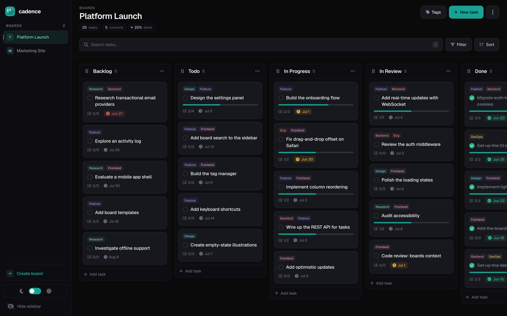
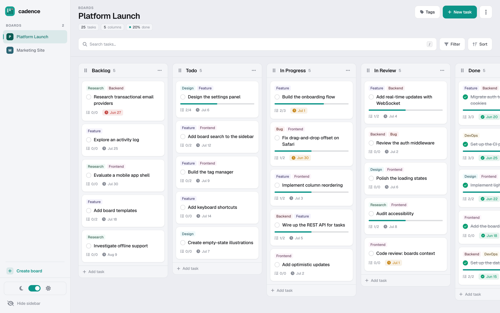

# Cadence API

**Cadence** is a fullstack Kanban board for daily task management — organize work across multiple boards, columns and tasks, with drag-and-drop, subtasks, color labels, due dates and light/dark themes.

This repository is the **backend** (Laravel REST API). It serves a separate **Next.js frontend** ([cadence-app](https://github.com/maricastroc/cadence-app)) over HTTP, with authentication handled by a secure **httpOnly session cookie**.

🔗 **Live API:** [api.marianacastro.dev](https://api.marianacastro.dev) · **App:** [cadence.marianacastro.dev](https://cadence.marianacastro.dev/) — click **"Explore the demo"** on the login page to jump straight in, no sign-up required.

---

## ✨ Features

**Boards & workflow**
- CRUD for boards, with one active board per user (switching activates a single board at a time)
- Workflow columns per board, reorderable — positions of the other columns are recalculated automatically
- Policy-based authorization: every board, column, task, subtask and tag is scoped to its owner

**Tasks**
- CRUD for tasks with title, description and due date
- Move a task across columns or reorder it within a column — the API reindexes the affected columns in a single transaction
- Toggle completion: completing a task ticks off its whole checklist; re-opening it leaves the subtasks untouched
- Subtasks managed inline with the task (created, updated and removed in one request) plus toggle-completion and bulk reorder

**Labels**
- CRUD for color-coded tags, scoped per user
- Attach and detach multiple tags to/from a task

**Auth**
- Register, login and logout via **Laravel Sanctum** tokens
- **One-click demo** — `POST /api/demo-login` signs into a shared demo account whose sample workspace is reseeded on every entry
- Token delivered in an **httpOnly cookie** that JavaScript can't read — see [Authentication](#-authentication)

**Docs & tooling**
- Interactive **OpenAPI / Swagger UI** for the whole API — see [API Documentation](#-api-documentation)
- Feature test suite with [Pest](https://pestphp.com/)

---

## 🖼️ Screenshots

<table>
  <tr>
    <td align="center" width="62%"><strong>Desktop</strong></td>
    <td align="center" width="38%"><strong>Mobile</strong></td>
  </tr>
  <tr>
    <td valign="top"></td>
    <td rowspan="2" valign="top"></td>
  </tr>
  <tr>
    <td valign="top"></td>
  </tr>
</table>

---

## 🧱 Tech Stack

**Backend (this repo)**
- [Laravel 12](https://laravel.com/) · [PHP 8.3](https://www.php.net/) — REST API
- [Laravel Sanctum](https://laravel.com/docs/sanctum) for token-based authentication
- [PostgreSQL](https://www.postgresql.org/) with [Eloquent ORM](https://laravel.com/docs/eloquent) and API Resources
- Policy-based authorization for every resource
- [L5-Swagger](https://github.com/DarkaOnLine/L5-Swagger) (OpenAPI 3) for interactive API docs
- [Pest](https://pestphp.com/) for feature tests
- [Laravel Telescope](https://laravel.com/docs/telescope) (debugging), [Pint](https://laravel.com/docs/pint) + [Rector](https://getrector.com/) (code style & refactoring)

**Frontend ([cadence-app](https://github.com/maricastroc/cadence-app))**
- [Next.js 14](https://nextjs.org/) · [React 18](https://react.dev/) · [TypeScript](https://www.typescriptlang.org/)
- Deployed on Vercel (`cadence.marianacastro.dev`)

---

## 🏛️ Architecture

The app is split into two deployments:

```
Browser ──> cadence.marianacastro.dev   (Next.js · Vercel)        ← cadence-app
   │
   └── XHR (withCredentials) ──> api.marianacastro.dev   (Laravel · Railway)   ← this repo
```

The API is served from a **subdomain of the frontend's domain**, so both are *same-site*. That lets the auth cookie use `SameSite=Lax` and stay reliable across browsers (Safari included).

### 🔐 Authentication

Auth uses a **Sanctum token carried in an httpOnly cookie** — the token is never exposed to JavaScript, which mitigates token theft via XSS.

1. On **login / register / demo-login**, the API issues a Sanctum token and sets it as an `httpOnly` cookie (`SameSite=Lax`, `Secure` in production).
2. On every request the browser sends the cookie; the `AuthenticateWithCookie` middleware promotes it to an `Authorization: Bearer` header so Sanctum authenticates it transparently.
3. `GET /api/user` returns the authenticated user — used by the frontend to probe its auth state.
4. **Logout** revokes the current token and clears the cookie.

---

## 📖 API Documentation

Interactive Swagger UI, generated from OpenAPI annotations, is available at:

- **Live:** [api.marianacastro.dev/api/documentation](https://api.marianacastro.dev/api/documentation)
- **Local:** [localhost:8000/api/documentation](http://localhost:8000/api/documentation)

The UI includes a server selector (Production / Local), so you can try requests against either environment. Regenerate the spec after changing annotations:

```bash
php artisan l5-swagger:generate
```

---

## 🚀 Getting Started

### Prerequisites
- [PHP 8.3+](https://www.php.net/) and [Composer](https://getcomposer.org/)
- A [PostgreSQL](https://www.postgresql.org/) database

### 1. Clone & install

```bash
git clone https://github.com/maricastroc/cadence-api.git
cd cadence-api
composer install
```

### 2. Configure the environment

```bash
cp .env.example .env
php artisan key:generate
```

Set your database credentials in `.env` (defaults expect a local PostgreSQL):

```bash
DB_CONNECTION=pgsql
DB_HOST=127.0.0.1
DB_PORT=5432
DB_DATABASE=cadence_api
DB_USERNAME=root
DB_PASSWORD=
```

### 3. Migrate & run

```bash
php artisan migrate
php artisan serve
```

The API is served at [http://localhost:8000](http://localhost:8000).

> ⚠️ Because auth is a `SameSite=Lax` cookie, a frontend on `localhost` **cannot** authenticate against the production API (that's cross-site, so the cookie isn't sent). For authenticated local development, run this API locally and point the frontend at `http://localhost:8000/api/`.

---

## 🧪 Testing

Feature tests with [Pest](https://pestphp.com/), covering the API's authorization and business logic — auth flows (including demo login), board activation, task move/reorder, task & subtask completion cascades, tag attach/detach, and column reordering.

```bash
php artisan test
```

---

## 📝 Engineering decisions

A few decisions worth calling out:

- **Decoupled REST API + SPA** (Laravel/Sanctum ↔ Next.js) rather than a monolith — which meant owning the cross-origin surface: CORS, credentialed requests and cookie behavior.
- **Auth in an httpOnly cookie instead of returning a bare token**, so it's never reachable from JavaScript (XSS can't steal it). The trade-off — cookies aren't sent cross-site — is resolved by serving the API from a subdomain, keeping it *same-site* so a `SameSite=Lax` cookie works across Vercel + Railway.
- **Ordering as first-class data**: moving and reordering tasks (and reordering columns) reindex the affected records inside a single database transaction, so positions never drift or collide under concurrent edits.
- **Policy-based authorization** on every resource, so ownership checks live in one place and every controller enforces them consistently.
- **Single-action controllers** for focused operations (move, reorder, toggle-completion, bulk-reorder), keeping resourceful controllers lean.

---

## 📄 License

Released under the [MIT License](LICENSE). You're free to use, study, fork and build on this code — **as long as the original copyright and license notice are kept**. Reuse it and learn from it; don't strip the attribution and present it as your own.

© 2025–2026 Mariana Castro
